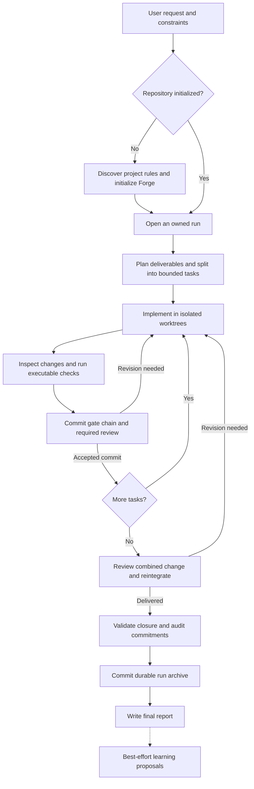
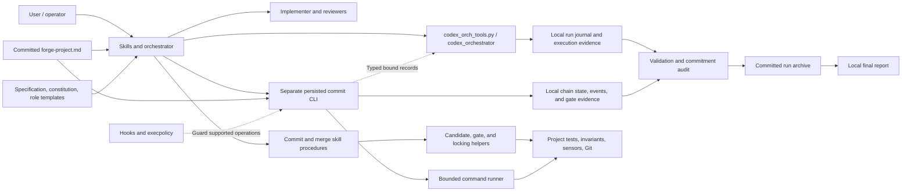
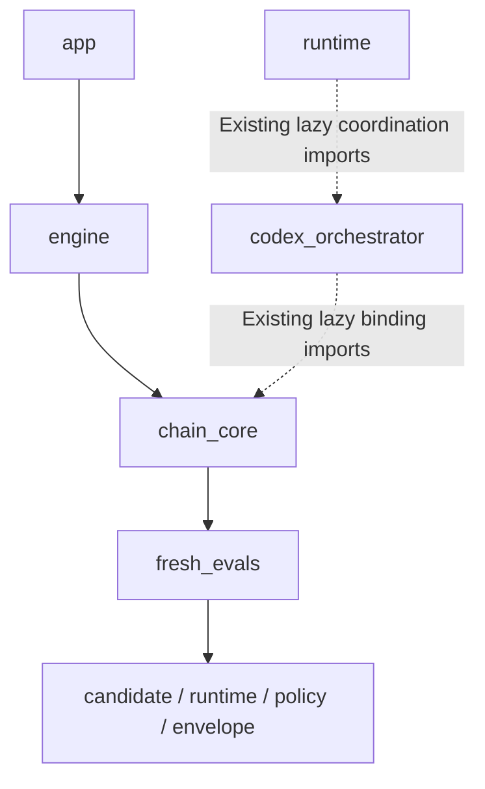
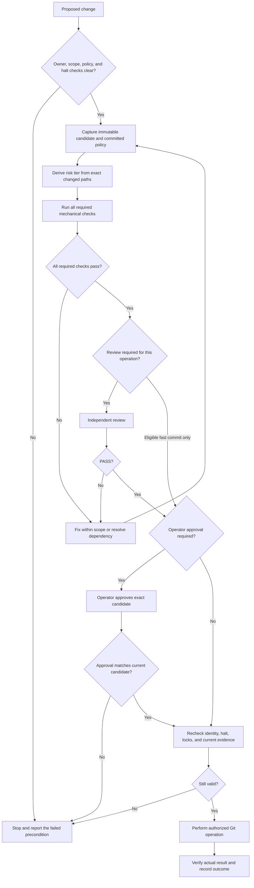
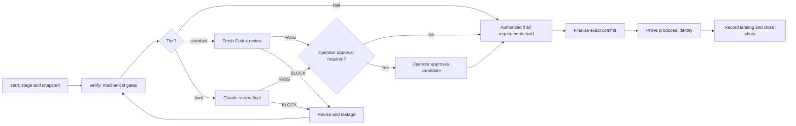
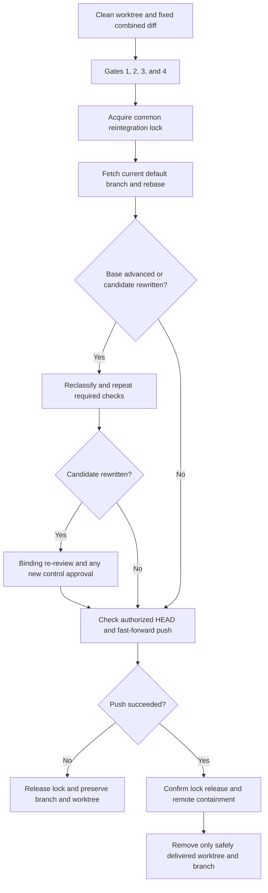

# Forge operations

Forge coordinates software changes from a user request through implementation,
verification, independent review, delivery, and a durable record. Its operating
model is **Decompose, Verify, Review, Reintegrate (DVRR)**: make the work small
enough to check, collect evidence that it works, have a separate reviewer challenge
it, and bring accepted changes back into the default branch.

This guide explains the process in plain language and maps it to the code that
implements it. It is descriptive documentation, not a replacement for the
[committed specification](docs/specs/forge-plugin-spec.md), the target repository's
committed `forge-project.md`, or the owning skill. Those sources govern execution.
Historical documents under `docs/design/` explain why decisions were made; later
specification amendments and shipped code must also be checked.

## 1. High-level process

The normal delivery unit is a **run**. A run contains smaller **tasks**, and each
task can require several agent **executions**, checks, and revisions. A **commit
chain** authorizes one exact staged change. A **merge gate chain** evaluates the
combined branch before reintegration. These are related but separate lifecycles.



This diagram shows a successful run, including ordinary revision loops. A halt,
unresolved failure, missing approval, or external dependency can stop progress.
Forge must preserve and report that state rather than claim delivery. Independent
units may be reintegrated incrementally; the diagram groups delivery for readability.

### Who does what

| Actor | Responsibility | Boundary |
|---|---|---|
| User/operator | Supplies goals, resolves consequential choices, approves control changes, and controls halts | Approval must identify the actual reviewed candidate |
| Claude main session | Plans, owns the run journal and worktrees, verifies evidence, coordinates gates, and reintegrates | An agent's handoff does not substitute for observed verification |
| Fresh Codex implementer | Implements an assigned task in its dedicated worktree | May commit through Forge in its own worktree; must not push or operate on another branch |
| Fresh Codex first-pass reviewer | Independently inspects the assigned candidate | Uses the native read-only sandbox and a separate session from the author |
| Claude `review-final` | Gives the binding final PASS/BLOCK where required | Must not edit; it can execute checks, and its no-write boundary is instruction-based |
| Forge scripts and CLI | Enforce mechanical preconditions, execute bounded checks, record evidence, and reject invalid transitions | They do not replace human approval or semantic review |

The shipped role configuration assigns Codex implementation to `gpt-5.6-sol` with
`ultra` effort and first-pass review to `gpt-5.6-sol` with `high` effort. Those are
controlled routing values, not runtime cost suggestions. Consult the current
[orchestration skill](skills/orchestrate/SKILL.md) before launching an execution.

## 2. Codebase design and logical boundaries

Forge combines two systems. The orchestration engine records **what work happened
and what the orchestrator observed**. The gate engine records **whether an exact
candidate has satisfied the requirements for a Git operation**. Skills connect
those systems to planning, reviewers, and operator decisions.



The diagram shows responsibility and data flow, not a claim that every operation
passes through one executable. `/forge:commit` implements its own five-step skill
procedure and uses shared candidate helpers; it is not a thin wrapper around
`forge commit ...`. The persisted commit CLI is a separate operational surface.
Likewise, the current worktree-merge skill orchestrates its own checks and Git
sequence, using the common-lock helper without owning a CLI merge chain.

### Implementation map

| Component | Code or configuration | What it owns |
|---|---|---|
| Lifecycle instructions | [`skills/`](skills/) | Initialization, planning, execution cycles, commits, reintegration, closure, drift, and learning |
| Public orchestration entry point | [`scripts/codex_orch_tools.py`](scripts/codex_orch_tools.py) | Run and journal commands, execution inspection, and validation |
| Orchestration engine | [`scripts/codex_orchestrator/`](scripts/codex_orchestrator/) | Typed records, run ownership, scope admission, journal batches, and recovery |
| Public gate entry point | [`scripts/forge/cli.py`](scripts/forge/cli.py) | Import-safe compatibility entry point forwarding into the CLI package |
| Application layer | [`forge_cli/app/`](scripts/forge/forge_cli/app/) | Dispatch, shared-verb routing, and the dormant merge engine |
| Gate behavior | [`forge_cli/engine/`](scripts/forge/forge_cli/engine/) | Commit lifecycle, classification, checks, review transport, approval, and finalization |
| Chain infrastructure | [`forge_cli/chain_core/`](scripts/forge/forge_cli/chain_core/) | Repository context, persistence, transitions, replay, coordination, and locks |
| Candidate identity | [`forge_cli/candidate.py`](scripts/forge/forge_cli/candidate.py) | Immutable Git-tree snapshot, authorization identity, and deterministic review artifact |
| Policy parsing | [`forge_cli/policy.py`](scripts/forge/forge_cli/policy.py) | Parsing committed regions into executable policy |
| Execution primitives | [`forge_cli/runtime.py`](scripts/forge/forge_cli/runtime.py) | Shared runtime controls, bounded subprocess execution, and coordination loading |
| Fresh reviewer evaluations | [`forge_cli/fresh_evals.py`](scripts/forge/forge_cli/fresh_evals.py) | Candidate-bound evaluation requests and evidence validation |
| Machine responses | [`forge_cli/envelope.py`](scripts/forge/forge_cli/envelope.py) | Structured outcomes and refusal reason codes |
| Enforcement surfaces | [`hooks/`](hooks/), [`system/codex/`](system/codex/) | Claude tool hooks and installed Codex routing/policy surfaces |
| Durable close | [`audit-commitments.py`](scripts/forge/audit-commitments.py), [`archive-run.py`](scripts/forge/archive-run.py) | Audit cited commitments and render the archive |

The intended dependency direction is enforced in
[`pyproject.toml`](pyproject.toml):



Upper layers may use lower layers directly. The dashed links summarize existing
cross-package exceptions recorded in the import-linter configuration; the system
is not completely free of dependency cycles. Compatibility exports also preserve
older import surfaces during refactoring. Passing import-linter means the declared
contracts hold with those explicit exceptions, not that all coupling is absent.

### Shipped behavior versus later design

At the source revision inspected for this guide:

- The public commit CLI is available. `python3 scripts/forge/cli.py --help` lists
  the commit, verification, review, journal, and common-lock commands.
- `MERGE_LIFECYCLE_ACTIVE` is `False` in `forge_cli/runtime.py`. The parser and
  dispatcher conditionally admit the merge command family. Merge implementation
  code exists, but its presence does not make that public workflow active.
- Reintegration uses [`/forge:worktree-merge`](skills/worktree-merge/SKILL.md).
  The later `forge merge ...` and standalone `forge push` contracts in the
  specification must not be presented as commands currently available here.
- The later CLI design uses bounded lock epochs and external review between
  epochs. The current skill instead performs its required post-rebase rechecks
  and renewed approval while holding the reintegration lock. Do not mix the two
  protocols.

## 3. Logical decision flow

Before a change can advance, Forge asks three different questions: **Is this
operation allowed? Does the candidate pass its checks? Has the required reviewer
or operator authorized this exact candidate?** A successful command from another
candidate or an earlier version cannot silently answer those questions.
For the persisted commit chain, operator approval is required both for control
changes and for an above-MINOR finding disposition, even on a non-control candidate.



### Risk tier and authority are separate

| Classification | Consequence |
|---|---|
| `fast` commit | Omits only the commit's adversarial reviewer; retains tests, other required checks, identity verification, halt checks, and locks |
| `standard` commit | Requires a fresh Codex first-pass reviewer |
| `hard` commit | Requires Claude `review-final` |
| Control-class change | Has a hard floor, strict baseline evaluation, applicable fresh reviewer evaluations, and explicit candidate-bound operator approval |
| Any reintegration | Requires binding `review-final`, including a branch made entirely of fast commits |

The declared task tier is advisory. Classification uses the exact candidate and
committed policy; it can promote scrutiny and cannot demote a declared tier.
Unmatched paths default to standard. Control and trigger paths impose a hard
floor. Dependency manifests have at least standard scrutiny. A file's `.md`
suffix alone does not make it fast: specifications, skills, and other policy
documents can be control-class.

Authority classes describe what the agent may do: `act-autonomously` for allowed
reversible work, `gated-approval` for work requiring explicit approval, `advisory`
for investigation/proposals, and `reserved` for operator-controlled actions.
Neither a low risk tier nor a reviewer PASS grants missing authority.

## 4. The process, step by step

### Step 1 — Initialize the target repository

**Purpose:** teach Forge the project's actual rules before asking it to enforce
them. The owning procedure is [`/forge:init`](skills/init/SKILL.md).

Initialization checks prerequisites and existing installation state, installs the
managed surfaces, and mines existing project documentation and tooling. It fills
`forge-project.md` with file categories, tests, validations, changelog rules,
invariants, review focus, mutation-tool availability, risk tiers, and drift
configuration. Existing project instructions and local customizations are
preserved according to the installer rules; conflicts are surfaced for review.

The policy is imported into Claude's instructions and rendered into Codex's
`AGENTS.md` region. Forge prepares evaluation baselines, checks routing and policy
surfaces, and obtains binding review plus approval of a frozen installation
candidate. Missing required regions or unresolved initialization placeholders
prevent normal gate execution.

The first-policy bootstrap, migration, and re-init paths differ. A first-policy
bootstrap separates the first committed policy from later activation. A migration
must preserve its durable report. Re-init does not automatically commit or push
its approved changes. Follow the init skill's branch for the actual repository
state; an instruction to initialize is not blanket approval of the resulting
control changes.

### Step 2 — Open and own a run

**Purpose:** record what the user asked for and establish who may change which
files. The owning procedure is [`/forge:workflow`](skills/workflow/SKILL.md).

The orchestrator identifies the repository root, current full Git SHA, branch,
and initial working-tree state. Existing changes remain attributed to their
original owner. Run material is locally excluded from Git before creation.

The typed `run-open` builder creates the run's ownership information and opening
journal entry atomically. It records the original goal, baseline, plugin
reference, and a nonempty set of repository-relative path scopes. A shared
registry refuses overlapping open-run scopes and ambiguous registry state. A
stable session identity must come from the long-lived harness, not a temporary
tool shell's PID.

An existing `.forge/tmp/drift-block` prevents new runs until the operator clears
it. A live foreign owner or unresolved scope conflict also prevents admission.
Creating a directory or manually appending JSON is not an alternative admission
path.

### Step 3 — Plan and decompose the work

**Purpose:** make success checkable before implementation begins.

The orchestrator translates the request into deliverables, acceptance criteria,
constraints, risks, and executable verification paths. Each task receives an
explicit file scope contained within the run's admitted scope.

For a consequential or hard-to-reverse choice, Claude writes its own plan before
reading a fresh Codex proposal. The two approaches are compared using evidence,
and the resulting decision cites both plans. Routine choices do not require
repeated planning reviews.

Tasks can run in parallel only when their files, contracts, generated outputs,
and shared resources do not overlap. Separate worktrees alone do not make
overlapping tasks independent. The plugin caps a run at 10 concurrent Codex
executions; available host capacity may impose a smaller limit.

### Step 4 — Prepare and launch an implementation execution

**Purpose:** give one agent enough context to complete one bounded assignment.

The orchestrator creates a dedicated worktree and assembles the prompt from the
role template, the worktree's committed project context, committed gotchas when
present, and the concrete assignment. It saves the exact prompt, creates the
events file, and appends the execution record **before** launching the process.

The execution record includes the actual worktree, full HEAD, branch, model,
effort, and evidence paths. The process launches detached in its own process
group, with PID, process-group ID, and launch time saved for monitoring. A halt
checkpoint must pass immediately before a new execution.

Each implementation execution uses a fresh agent/session. Only a targeted
confirmation round by the same reviewer may resume a reviewer session. An
implementer does not inherit approval from an earlier implementation attempt.

### Step 5 — Monitor progress and collect the handoff

**Purpose:** determine what actually happened without confusing silence with
failure or an agent's confidence with success.

Monitoring reads execution events and process state. The monitor must be rearmed
within 60 minutes while work remains in flight. A stale notification triggers an
inspection of event-file progress, the recorded process group, the handoff, and
the worktree. Staleness alone is not a terminal result. Unknown event formats are
reported as an incompatibility rather than interpreted as success or failure.

The orchestrator preserves the agent's exact handoff and inspects the resulting
diff. It records a terminal execution result only when the outcome is known. A
halt prevents new launches and reintegration; read-only observation of already
running work can continue.

### Step 6 — Verify the task against its acceptance criteria

**Purpose:** establish evidence that the requested behavior was delivered.

The orchestrator checks the actual files and runs the applicable tests and
validations. Before reintegrating agent work, it reruns the required checks in
its own integration target. A handoff saying “tests passed” is a claim to inspect,
not gate evidence.

Checks are recorded with their command, observed result, and evidence. After a
defect fix, the affected end-to-end verification must pass twice consecutively,
with separate records. Measurements affected by machine sleep or unstable load
must be repeated before being recorded as passing timing evidence.

An unresolved task stays active, becomes blocked by a real dependency, or is
marked failed when its criteria are conclusively unmet and no in-scope recovery
remains. Task completion is recorded after the relevant acceptance and landing
records, not merely because the implementer stopped.

### Step 7 — Run the commit gate chain

**Purpose:** authorize one exact staged tree to become a commit. The owning
procedure is [`/forge:commit`](skills/commit/SKILL.md).

The skill defines five steps: classify; validate; apply changelog policy; stage,
scan, and review; then prepare, commit, and clean up. The persisted CLI implements
the same obligations with its own explicit ordering: `commit start` stages and
classifies, and `verify` runs the changelog gate first because it can change the
candidate. Do not combine selected parts of the skill and CLI to omit a check.

The CLI path proceeds as follows:

1. **Start with explicit paths.** Refuse pre-existing staged content and select
   only session-owned paths. Read policy from a pinned committed HEAD. Stage the
   paths and capture an immutable candidate.
2. **Apply the changelog rule.** If configured, run it first. Its declared outputs
   are added to the candidate; changed output invalidates downstream evidence and
   causes classification to run again.
3. **Execute mechanical verification.** Run Gate 1 twice consecutively with
   matching environment fingerprints, then relevant stack validations, the
   assertion sensor, commit invariants, and a secret scan of the exact review
   artifact. Control candidates additionally require strict baseline integrity
   and any applicable candidate-bound fresh reviewer evaluations.
4. **Request the appropriate independent review.** Fast commits omit this review
   only. Standard commits use a fresh Codex reviewer; hard commits use
   `review-final`. The review package binds the candidate, policy, profile, and
   exact patch. It excludes the implementer's claimed results and earlier verdicts.
5. **Resolve findings.** BLOCK returns the change for revision. Restaging creates
   a new candidate and invalidates the old candidate's authority. Reverify after
   fixes. Eight review invocations without PASS require escalation, not a commit.
   Disposition of findings above MINOR requires explicit operator approval.
6. **Obtain operator approval when required.** The persisted commit chain requires
   it for a control-class candidate or an above-MINOR finding disposition. Approval
   names the current authorization ID. In the supported Claude hook workflow, the operator
   runs the approval verb directly via `!`; the model cannot approve itself.
7. **Finalize and inspect the produced commit.** Check halt state, locks,
   authorization freshness, current evidence, and the index again. After Git
   succeeds, verify the actual parent, tree, and message against the recorded
   intent before reporting the chain as landed.



**Candidate identity matters.** The authorization ID is derived from the complete
immutable Git tree, including file modes, symlinks, and gitlinks. The deterministic
review patch has a separate digest and byte count. A patch digest identifies
review evidence; it does not authorize a commit. A changed tree, moved HEAD,
stale authorization, or mismatched produced commit must be handled by the chain's
recovery rules.

The CLI persists completed steps, so `verify` resumes from the first incomplete
step. It does not automatically request review, approve a change, or finalize a
commit. `status --chain-id <id>` reports the next required action. A chain runs
without journal writes when no open run was explicitly supplied; it must never
infer the “latest” run.

### Step 8 — Review the combined branch and reintegrate

**Purpose:** prove that the complete branch works with the current default branch.
The current owning procedure is
[`/forge:worktree-merge`](skills/worktree-merge/SKILL.md).

First require a clean candidate worktree, including untracked files. Fix the
candidate's full HEAD, the remote default-branch base, and the exact combined
diff. Classify that range from committed policy. Then run:

| Gate | Plain-language question |
|---|---|
| Gate 1 — Project tests | Does the combined implementation pass the project's test contract? |
| Gate 2 — Stack validations | Do static checks, applicable invariants, and test-quality requirements pass? |
| Gate 3 — Binding review | Does an independent `review-final` accept the complete integrated proposal? |
| Gate 4 — Summary and authority | Has the exact candidate been presented, and has the operator approved it if control-class? |

Scoped mutation testing, when applicable, runs after Gate 1. Its result is
advisory evidence for Gate 3; a timeout, surviving mutant, or unavailable mutation
tool does not count as a passing gate. The Python assertion sensor and executable
invariants have their own blocking rules. These mechanisms are not interchangeable.

After all pre-lock requirements pass, acquire the common Git reintegration lock,
fetch the current default branch, and rebase onto it. This keeps the default
branch linear. When the base advances or the candidate is rewritten, repeat the
required tests, validations, classification, and mutation evidence against the
integrated result. A rewritten candidate also needs binding re-review; a control
change needs approval of its new full SHA.



Any failed required check stops before push. A failed push preserves the worktree
and branch. Cleanup begins only after successful push and proof that the remote
default branch contains the pushed SHA. Worktree removal must not discard
residual files. Report push, lock release, and cleanup outcomes separately.

### Step 9 — Reconcile records and close the run

**Purpose:** make sure the recorded story matches delivered work before declaring
the run complete.

Once tasks are terminal, the orchestrator rereads the complete journal and checks
the final repository against the opening baseline. Typed builders append missing
records and supported corrections; journal history is not rewritten.

Run gated validation before closure. This pre-close check is advisory because
some requirements can be evaluated only after the closing record exists. The
typed close builder records `passed` or `blocked`, the summary, risks, follow-ups,
and the exact pre-close validation payload. Run gated validation again after
closure and save its exact JSON output. The post-close check must exit zero.

For a passed run with mutating work, current required gate evidence must follow
the relevant completed executions. Failed gates need a later passing recheck of
the same criterion. Activated journals also correlate task, chain, candidate,
approval, and landing identities. A PASS for a different tree or unrelated task
does not fill a missing gate.

Supported superseded-candidate and abort-disposition rules preserve unsuccessful
history without treating it as delivered evidence. An unrepairable closed journal
cannot be made valid by editing old lines; use the prescribed successor or
operator recovery procedure.

### Step 10 — Audit and commit the durable archive

**Purpose:** preserve the intent, evidence, and decisions in Git so the result can
be understood without the original machine's working state.

After successful post-close validation, capture the actual closing HEAD before
other repository operations. Require a clean tree. In this plugin's own source
repository, run the routing-conformance audit as well. Then audit commitments:
referenced tasks, decisions, artifacts, and bound chain evidence must be resolvable.

Render `.forge/history/runs/<run-id>.md` from the journal, audit results, captured
closing SHA, and exact post-close validation result. The archive contains the
goal, task acceptance criteria, decisions and their basis, gate evidence, risks,
follow-ups, and provenance. Historical findings remain visible.

The archive must be the only changed/staged path in its archive-only commit,
which goes through the normal Forge commit chain. Existing archives are
append-only durable records: do not overwrite, amend, or prune them.

### Step 11 — Write the final report

**Purpose:** give the user an accurate account of delivery and remaining work.
The owning procedure is [`/forge:report`](skills/report/SKILL.md).

The report skill reruns gated validation and proves the archive exists in HEAD
without staged or unstaged changes. Only then does it write the run's local
`report.md`. The report has five sections: Summary, Changes, Orchestration Graph,
Consensus, and Final Results. Its Mermaid graph reflects observed execution and
decision history, including meaningful revision loops.

The final result states the actual judgment, failed or unresolved checks,
accepted risks, and follow-ups. Validation checks bookkeeping completeness; it
does not independently prove that the software is correct.

### Step 12 — Learn from completed work and check for drift

**Purpose:** improve future work without silently changing the rules that govern
it. These are separate procedures with different authority.

**Learning** runs as one best-effort pass after a completed run report or completed
drift report. [`/forge:learn`](skills/learn/SKILL.md) gives a fresh read-only
reviewer three evidence inputs: canonical journal patterns, committed archives,
and committed gotchas. Accepted proposals can create candidate evaluations under
`.forge/evals/candidates/` and append traceable gotchas. They remain unstaged and
uncommitted. Promoting an evaluation into `.forge/evals/tasks/` is a separate
control-class change. Learning failure cannot reopen or invalidate delivery.

**Drift sensing** checks whether policy and practice have diverged over time.
Hooks provide staleness reminders; scheduled automation can run the mechanical
checker without a model. An operator invokes
[`/forge:drift`](skills/drift/SKILL.md) for the full mechanical-plus-semantic review.
The checker first requires a clean tree, then examines configured checks,
invariants, evaluations, mutation evidence, category coverage, policy staleness,
telemetry, and journal patterns. Mechanical exit 0 means clean, exit 1 means a
valid drift-present result, and exit 2 means the check failed and semantic review
must not begin.

The semantic reviewer receives the validated mechanical summary, preserves the
findings, and produces a durable report under `.forge/history/drift/`. Only after
that report is committed can a semantic CRITICAL finding create
`.forge/tmp/drift-block`. This blocks new runs until the operator clears it.
MAJOR and MINOR drift findings do not create that block. A drift block is distinct
from an `AGENT_HALT` sentinel.

## 5. Evidence, state, and recovery

### Where the records live

| Artifact | Lifetime and purpose |
|---|---|
| `forge-project.md` | Committed project policy; gate execution reads an authenticated committed revision |
| `.forge-manifest` | Installation and activation metadata; does not replace gate evidence |
| `.codex-orchestrator/runs/<run-id>/journal.jsonl` | Locally excluded append-only run history |
| Execution `prompt.md`, `events.jsonl`, `handoff.md`, and `pid` | Local exact assignment, raw events, final agent message, and process identity |
| `.forge/chains/` | Local persisted chain state, events, and evidence, rooted in the common repository context |
| `.forge/tmp/` | Transient authorization markers, registry, drift output, audit logs, and telemetry |
| `.forge/history/runs/<run-id>.md` | Committed durable run archive |
| Run-local `report.md` | Final human-facing report, written after the archive commit |
| `.forge/history/drift/` | Committed periodic drift reports |
| `.forge/evals/candidates/` and `.forge/history/gotchas.md` | Advisory learning proposals and accumulated lessons |

The journal records lifecycle and judgment; command evidence supports verification;
chain events support candidate-bound authorization and landing. Chain events are
written before the materialized state file; authenticated replay can reconstruct
a missing or stale state projection. Typed journal
builders use idempotency keys and ownership checks. Bound chains can carry a
pending journal outbox, and supported recovery replays authenticated records
rather than inventing a successful outcome. The journal is not a replacement for
the chain's mechanical evidence.

### Common interruptions

| Condition | Required response |
|---|---|
| Missing or unfilled committed policy | Stop the gate chain and initialize or repair policy through its controlled process |
| Halt sentinel | Stop new launches and reintegration, report it, and wait for operator direction |
| Uncertain execution status | Inspect saved events, PID/PGID, handoff, and worktree before recording an outcome |
| Failed test or BLOCK review | Preserve the result, revise within scope, and rerun required checks and review |
| Candidate or HEAD drift | Use the chain's restage/rebase recovery path or restart as directed; do not relabel old evidence |
| Required approval absent | Keep the reviewed candidate pending and present the exact operator action |
| Interrupted CLI verification | Inspect `status` and resume `verify` from the first incomplete step |
| Produced commit differs from intent | Preserve the commit and frozen chain for operator disposition; do not automatically reset or amend it |
| Reintegration failure | Preserve the branch and worktree; report the observed failure and lock outcome |
| Foreign/live owner or stale reintegration lock | Follow the specific ownership/lock recovery procedure; do not delete state to force progress |
| Post-close validation or archive audit failure | Do not generate a final report claiming delivery |
| Machine move | Close and archive on the original host, then start a fresh run using the committed archive |

Ordinary non-mutation policy commands run from the repository root as one complete
`bash -c` cell, with arguments passed separately. They use an isolated process
group, a 65,536-byte combined-output cap, and a 1,200-second fail-closed timeout.
Mutation commands have their configured row/default timeout and advisory result
semantics. Missing tools, malformed outputs, or timeout do not become a PASS.

Hooks and policy are mistake-prevention controls for cooperative agents, not a
security sandbox against an adversarial process with the operator's OS privileges.
The Codex review sandbox and Claude review instructions also provide different
kinds of isolation. Operational reports should preserve those distinctions.

## 6. Working on the Forge source repository

Installed target repositories supply their own test and validation policy. This
source repository additionally requires its full unittest discovery gate, routing
conformance, Python size limits, and import-boundary checks. Its configured Gate 1
fans the full module set across up to four subprocesses and refuses empty discovery
or a shard without a final unittest summary.

Before finishing source work, run the repository's required checks:

```bash
ruff check scripts tests system/fr223 && git ls-files -z "*.py" | xargs -0 python3 scripts/check_file_length.py && PYTHONPATH=scripts:scripts/forge lint-imports
```

Changes to control surfaces also require focused evidence that detects disabled
controls, applicable STRICT evaluations, independent binding review, and explicit
operator approval. Docs-only explanatory changes do not become permission to
alter the specification or gate configuration.

## 7. Reference map

| Question | Authoritative procedure or implementation |
|---|---|
| What must Forge do? | [Specification](docs/specs/forge-plugin-spec.md) |
| Why was the architecture chosen? | [Founding decisions](docs/design/0001-founding-decisions.md), [verification expansion](docs/design/0002-verification-expansion.md), [CLI design](docs/design/0003-forge-cli-plumbing.md) |
| How is a repository prepared? | [Init skill](skills/init/SKILL.md) |
| How is a complete run managed? | [Workflow skill](skills/workflow/SKILL.md) |
| How is one execution launched and monitored? | [Orchestrate skill](skills/orchestrate/SKILL.md) |
| What do journal records mean? | [Orchestration contract](docs/orchestration-contract.md) |
| How is a commit authorized? | [Commit skill](skills/commit/SKILL.md), [CLI entry point](scripts/forge/cli.py) |
| How does accepted work reach the default branch? | [Worktree-merge skill](skills/worktree-merge/SKILL.md) |
| What makes a review sufficient? | [Review constitution](rules/review-constitution.md), [review-final agent](agents/review-final.md) |
| How is delivery reported? | [Report skill](skills/report/SKILL.md) |
| How are decay and recurring mistakes handled? | [Drift skill](skills/drift/SKILL.md), [learn skill](skills/learn/SKILL.md) |
