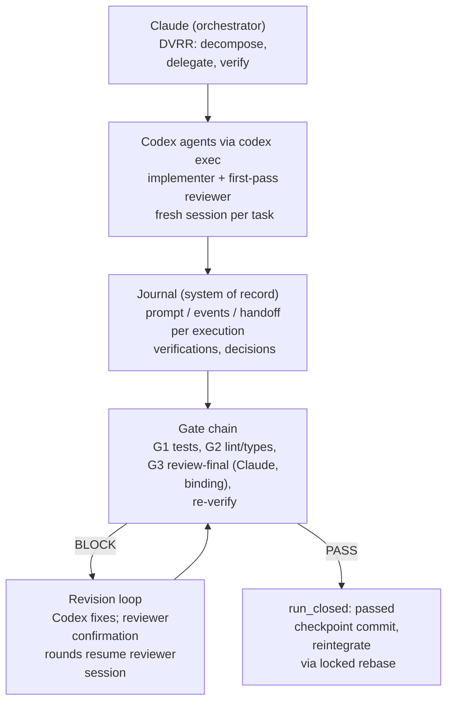

# claude-forge — Founding Decisions

**Status:** agreed 2026-08-08 (Igor + Claude). This document records the founding
architecture and the resolutions of the five design decisions. It is the input to the
full specification; it is not the spec.

## TL;DR

claude-forge is a single Claude Code plugin that merges two systems into one
streamlined pair-orchestration platform:

- **forge** (github.com/nixlim/forge) supplies the *governance*: the DVRR operating
  model, fail-closed commit/merge gate chain, adversarial review constitution with
  binding verdicts, risk/authority classes, operator kill-switch, eval harness.
- **codex-orchestrator** (fork of alexzh3/codex-orchestrator) supplies the *execution
  engine*: durable run journal (`journal.jsonl`), exact prompt/events/handoff
  preservation per execution, Claude-observed verification, descriptive `validate`
  tool, resume-after-context-loss.

**Claude + Codex only.** All opencode support is deleted. Claude Code is the
orchestrator/verifier harness; Codex CLI (headless `codex exec`) is the execution
muscle. This is a deliberate divergence from upstream forge — claude-forge is the new
forge; upstream syncs are assessed case-by-case, not automatic.

## Architecture

Role split:

| Role | Runs as | Notes |
|------|---------|-------|
| Orchestrator / verifier | Claude (main session) | Owns journal, worktrees, gate chain, everything touching `main` |
| Implementer | Codex agent (fresh session) | May commit **only inside its execution worktree** |
| First-pass reviewer (`review-cheap` analog) | Codex agent (fresh session) | Independent, per orchestration contract; confirmation rounds resume its session |
| Final reviewer (`review-final`) | Claude subagent (read-only) | Binding PASS/BLOCK; cross-model separation of duties by construction |

Cross-model separation of duties: the author (Codex/GPT family) and the binding
reviewer (Claude family) never share a model's blind spots. This is stronger than
upstream forge's same-family separation and is the heterogeneous-ensemble argument
from codex-orchestrator's README made structural.

## The Five Decisions — Resolutions

### D1 — Commit authority: RESOLVED

Codex may commit only inside its execution worktree (pre-integration artifacts).
Claude runs the gate chain and owns all reintegration onto the default branch.
Forge's Codex implementer template ("NEVER commit") is reworded accordingly.
Checkpoint commit after every verified task is **mandated** (upstream skill left
cadence open; forge's commit-per-unit doctrine wins).

### D2 — Reviewer routing: RESOLVED

`review-cheap` = fresh Codex agent (the contract's "independent Codex review").
`review-final` = Claude subagent, binding verdict. **A failing final review always
enters the revision loop**: findings go back to the implementer (Codex), fixes are
re-verified (Gate 1/2 re-run by the orchestrator in its own environment), and review
re-runs — up to forge's 8-iteration cap, at which point residual risk is recorded and
the run escalates; it never commits. Reviewer confirmation rounds may resume the
reviewer's session (persistent adversary with memory of its own findings) — the
single sanctioned use of `codex exec resume`, acceptable because reviewers are
read-only.

### D3 — Plugin vs per-repo layer: RESOLVED — single region file, two render targets

The repo carries **one file**, `forge-project.md` at repo root, containing the filled
`FORGE:REGION` blocks (Gate-1 test command, validation tables, review triggers,
project context) plus a compact DVRR spine and pointers to plugin skills.

- **CLAUDE.md**: imports it mechanically via `@forge-project.md` (Claude Code native
  import).
- **AGENTS.md (Codex)**: Codex does not expand `@`-imports, so `/forge-init` splices
  the same content between `<!-- FORGE:BEGIN -->` / `<!-- FORGE:END -->` markers,
  refreshed idempotently on re-init (filled regions carried forward, exactly as
  upstream forge's installer does).

Fail-closed is structural: plugin gate skills *read* `forge-project.md`; missing or
unfilled regions → Gate 1 refuses to pass. `/forge-init` shrinks to: region file +
AGENTS.md splice + `.codex/` config (agents TOML, execpolicy rules, hooks) +
gitignore block + eval fixtures.

### D4 — Gate recording in the journal: RESOLVED — Level B from day one (2026-08-08)

Ship **Level B**: gates are recorded as ordinary `verification` entries with a naming
convention (`criterion: "gate-1: project tests"`, `"gate-3: review-final verdict"`,
etc. — Level A's convention), **and** the `validate` tool is extended to enforce it:

- `run_closed` with `judgment: passed` is an **issue** unless a passing
  `gate: review-final` verification exists after the last repo-mutating execution;
- a failed gate verification with no subsequent passing recheck is an issue.

No new entry types — the schema stays the upstream seven, so journals remain readable
by upstream tooling; the gate checks are additive. **This makes fail-closed
mechanical** — something upstream forge never achieved on any harness. Candidate
upstream contribution as an opt-in profile flag.

Rejected: Level A alone (prompt-level enforcement only — the exact gap forge always
had) and Level C (a new `gate` entry type — breaks upstream journal compatibility
with no current justification).

Every `validate` change is control-class by forge's own rules (it is a gate), and
Level B deliberately shifts the upstream philosophy ("validation detects omissions;
Claude decides acceptance") toward enforcement. Adopted with eyes open.

### D5 — Provenance and upstream sync: RESOLVED — deliberate divergence

claude-forge is the new forge. Igor maintains upstream forge; claude-forge diverges
freely. When either upstream (forge, alexzh3/codex-orchestrator) updates, we assess
and cherry-pick — no automatic sync obligation. Keep an `UPSTREAM` manifest (forge's
pattern) recording both upstream refs and deliberate deviations.

## What Is Deleted from forge

- All of `.opencode/**` (11 agent defs, `opencode.jsonc`, opencode command/skill
  mirrors)
- Three-harness lockstep rules; temperature routing (Claude `effort` + Codex
  `model_reasoning_effort` remain)
- Strong/weak tier tables → replaced by the role-split table above

## Operational Hardening (from the production build, folded into the plugin)

All discovered through failures in a real long-horizon build; the stock skill's core
(journal, prompt/events/handoff preservation, independent verification, fresh-context
reviewers) held up — these harden the operational shell around it.

**Launch mechanics**

- Detached launches, not harness background tasks: `nohup … & disown` in its own
  process group (session layer killed tracked background Codex wrappers 5× across
  M0/M3; zero since).
- Fresh Codex session per task; never `codex exec resume` for implementers (resumed
  sessions degraded to read-only sandboxes, forcing patch-file delivery). Sole
  exception: reviewer confirmation rounds (D2).
- Literal paths in shell redirects (dcg hook rejects `$VAR`-based redirect targets).
- Never pass `-C` to `codex exec resume` (rejects the flag).

**Monitoring**

- Create the events file **before** the journal `execution` entry, or arm the monitor
  after launch — monitor treats a declared-but-missing events path as fatal (race,
  hit twice).
- Re-arm the monitor hourly; treat "stale" as ambiguous: check file mtime + process
  liveness before concluding (machine sleep produces false stalls).

**Journal discipline**

- Copy the contract doc's JSONL examples exactly (execution IDs as strings like
  `"execution-01"`, tasks keyed by `id`, arrays not scalars) — wrong shapes
  permanently fail validation and force a successor run.
- Never splice/guess git SHAs — record `$(git rev-parse HEAD)` output directly;
  transcription errors need append-only correction entries.

**Verification (beyond the stock skill's baseline — now mandatory gates)**

- Orchestrator re-runs all gates in its own environment before any commit (caught the
  only false "all gates green" handoff of the build — a post-verification change by
  the agent). *Converges with forge's re-verify doctrine.*
- Two consecutive e2e runs required after defect fixes; benchmark results taken
  during machine instability are re-measured before being trusted.
- Leak checks use real canonical answers with positive controls, never invented
  strings.
- Checkpoint commit after every verified task. *Converges with forge's
  commit-per-unit.*

**Structural habits (promoted from habit to rule)**

- Orchestrator writes its independent plan **before** reading Codex's design proposal
  each milestone (anti-anchoring — forge's `/review-spec` doctrine, now applied to
  planning consensus).

## Upstream Contribution Strategy

| Amendment | Destination |
|-----------|-------------|
| Monitor race fix (events-file ordering), stale-is-ambiguous, hourly re-arm | PR to alexzh3/codex-orchestrator |
| Resume-degradation warning, launch mechanics, `-C`+resume incompatibility | PR to alexzh3/codex-orchestrator |
| Journal-shape pitfalls (docs), SHA discipline | PR to alexzh3/codex-orchestrator |
| Gate naming convention + Level-B `validate` profile | Fork-only; offer upstream as opt-in profile |
| DVRR wiring, constitution, gate chain, worktree/locks, kill-switch, evals | claude-forge only |

## Retained forge Assets (Claude + Codex only)

- Review constitution (8 lenses, numbered principles, binary verdicts, 8-iteration
  cap) — the bulk of the system's value
- Gate chain definition; risk/authority classes; control-integrity policy;
  untrusted-input rule; operator halt (`AGENT_HALT` sentinel)
- Cross-session locks (rebase lock + commit lock — still the only thing no harness
  ships); worktree workflow with locked rebase / FF-push reintegration
- Eval harness (`run-evals.sh` + golden tasks); **new fixture source: real journal
  runs** — recorded failures with exact prompts/events/handoffs are ideal golden
  tasks
- `.codex/` layer: agent TOMLs (model + `model_reasoning_effort`), execpolicy
  deny-list (`forge.rules` — mechanical kill-switch for every orchestrated
  `codex exec`), Stop-hook telemetry
- Mechanical enforcement upgrades available on this harness: plugin `PreToolUse` hook
  checking `AGENT_HALT` + gate-passed marker before `git commit`/`git push`

## Next Steps

1. Full specification (spec-first; adversarial review before implementation)
2. Repo skeleton: plugin manifest, skills layout, `UPSTREAM` manifest, vendored
   sources
3. Implementation per spec; Level B (gate convention + `validate` enforcement) from
   day one
4. Upstream PRs to alexzh3 per the contribution table
